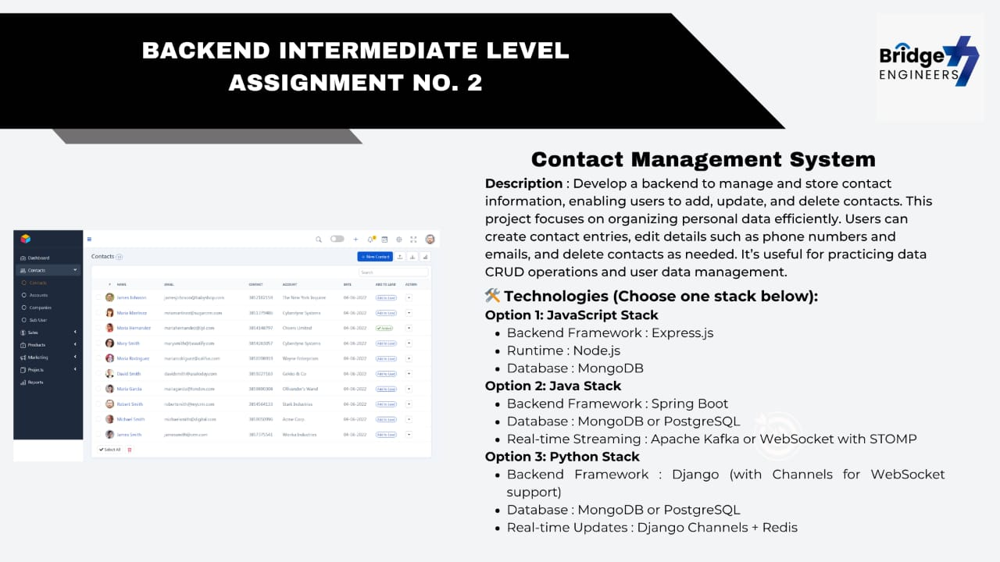
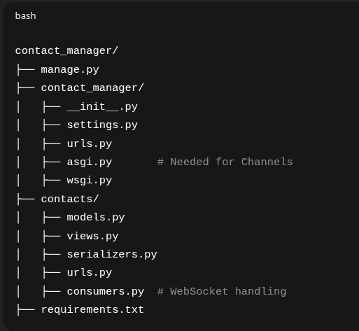
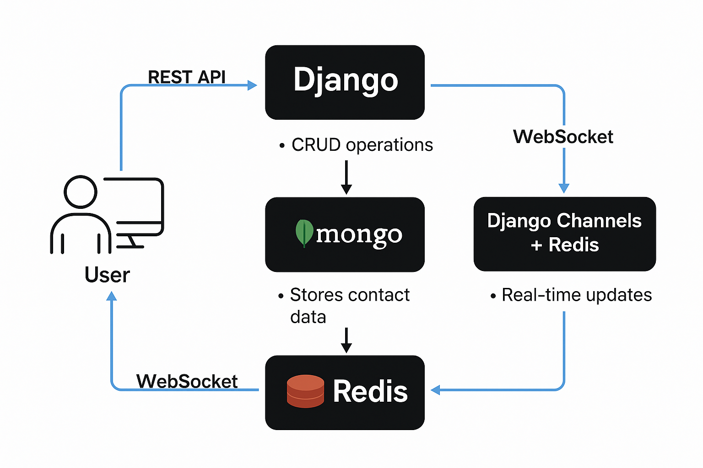
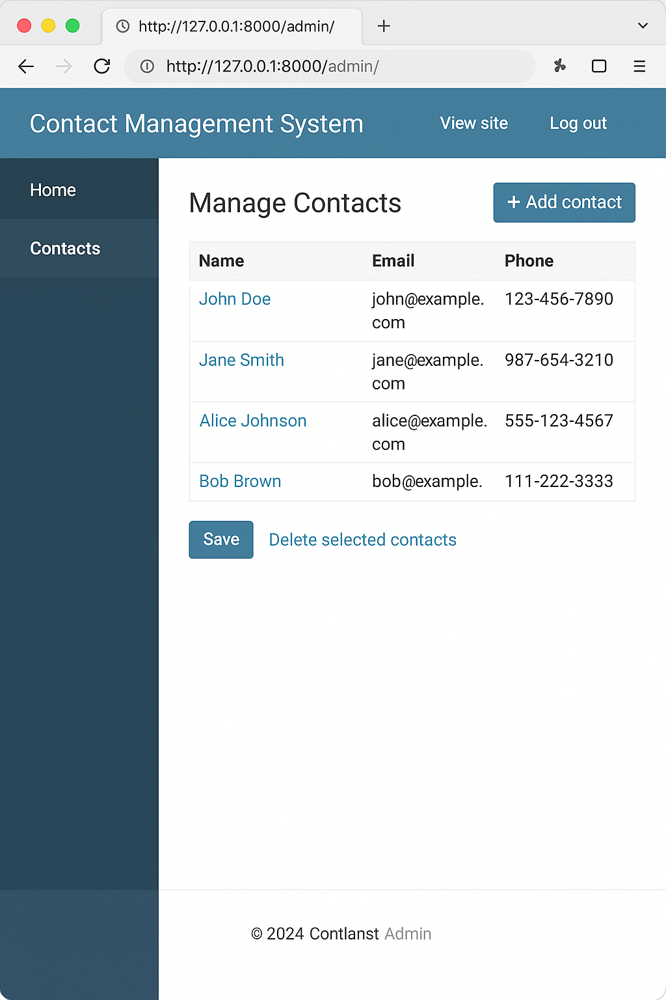

# Assessment-2





| Component            | Role                               |
| -------------------- | ---------------------------------- |
| **Django**           | Handles the backend logic          |
| **MongoDB**          | Stores contact data                |
| **Django REST**      | Provides API endpoints (CRUD)      |
| **Channels + Redis** | Pushes real-time updates           |
| **WebSocket**        | Keeps the browser always listening |

---
# Structure


---
# Contact Management System

A Django-based Contact Management System that allows users to add, update, and delete contact entries with real-time updates. Built with MongoDB as the backend database and Django Channels + Redis for WebSocket-based live updates.

## Features
- Add, Edit, Delete Contacts
- MongoDB for document-based storage
- Django Admin Panel for management
- REST API using Django REST Framework
- Real-time updates using Django Channels and Redis

## Tech Stack
- **Backend:** Django
- **Database:** MongoDB (via Djongo)
- **Real-Time:** Django Channels, Redis
- **API:** Django REST Framework

## Getting Started

---
### Prerequisites
- Python 3.8+
- MongoDB
- Redis

### Installation
```bash
git clone https://github.com/yourusername/contact-management-system.git
cd contact-management-system
python3 -m venv venv
source venv/bin/activate
pip install -r requirements.txt
```

### Environment Variables
Create a `.env` file in your root project directory:
```
MONGO_DB_NAME=your_db
MONGO_USER=your_user
MONGO_PASS=your_pass
MONGO_HOST=localhost
MONGO_PORT=27017
```
Make sure to load these in `settings.py` using `os.environ.get()`.

### Running the Project
```bash
sudo systemctl start mongod
sudo systemctl start redis
python manage.py makemigrations
python manage.py migrate
python manage.py createsuperuser
python manage.py runserver
```

Visit:
- Admin Panel: http://127.0.0.1:8000/admin/
- API Endpoint: http://127.0.0.1:8000/api/contacts/
- WebSocket: ws://127.0.0.1:8000/ws/contacts/

### Deployment
Add a `Procfile` if deploying on Heroku:
```
web: daphne contact_project.asgi:application
```

---
**.gitignore**
venv/
__pycache__/
*.pyc
.env
db.sqlite3

---
# Output


---

**Procfile**
web: daphne contact_project.asgi:application
